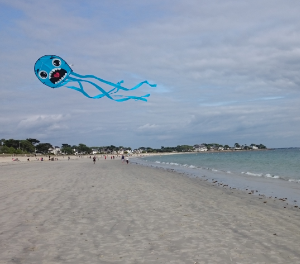

# Folie 1

## Ziele
1. Eins
2. Zwei
3. Drei

--

## Inhalt des Workshops

Normal
* Punkt
  * Unterpunkt
* Installation von Betriebssystem

---

## Raspberry Pi

Übersicht

<iframe 
    src="https://de.wikipedia.org/wiki/Raspberry_Pi" 
    allowfullscreen="" 
    frameborder="0" 
    height="480"
    width="1000">
</iframe>

---

--

--

## Snips Installieren

Quelltext

`System.out.println("Test");`

Mehr Quelltext 

`sudo npm install -g snips-sam`

